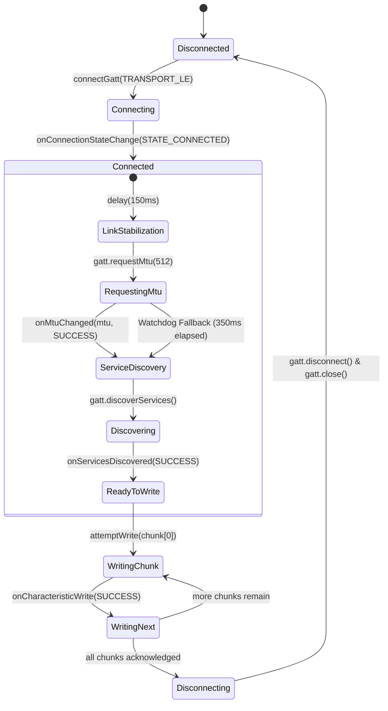

# MeshRoute — Comprehensive Technical Specifications & Transformation Blueprint

This document specifies the exact technical requirements, data protocols, hardware lifecycle constraints, routing state machines, and migration methodology required to adapt or transform a generic peer-to-peer / mesh codebase (e.g., AlertNet, Knit, MeshLink) into **MeshRoute**: an offline-first, store-carry-forward emergency mesh communication system.

---

## 1. System Architecture & Topology

### 1.1 High-Level Topology
MeshRoute does not rely on dedicated infrastructure nodes, static cluster heads, or internet connectivity at the point of origination. Every physical device operates as a peer that dynamically assumes one or more operational roles:

```
[Off-Grid Wilderness Zone]                                [Connected Zone]
 ┌──────────────┐         BLE GATT          ┌──────────────┐          BLE GATT          ┌──────────────┐      HTTPS / REST      ┌─────────────────┐
 │   Phone A    │ ────────────────────────► │   Phone B    │ ────────────────────────►  │   Phone C    │ ─────────────────────► │ MeshRoute Cloud │
 │ (Originator) │   Encrypted SOS Frame     │   (Relay)    │    Encrypted SOS Frame     │  (Gateway)   │     Idempotent POST    │  & Web Ingest   │
 └──────────────┘                           └──────────────┘                            └──────────────┘                        └────────┬────────┘
        │                                          │                                           │                                         │
   Store Locally                              Store & Carry                               Store & Carry                                  ▼
(Room SQLite Queue)                        (Room SQLite Queue)                         (Room SQLite Queue)                        ┌─────────────┐
                                                                                                                                  │  Emergency  │
                                                                                                                                  │  Dashboard  │
                                                                                                                                  └─────────────┘
```

### 1.2 Device Roles (Dynamic, Non-Hardcoded)
1. **Originator (Sender)**: Captures emergency inputs (GPS coordinates, hiker medical notes, battery status), encrypts payload using AES-256-GCM, enqueues into local durable disk storage, and broadcasts to local BLE neighbors.
2. **Relay (Carrier)**: Receives inbound ciphertext frames, verifies packet integrity and lifetime, checks atomic deduplication (`SeenSet`), stores to disk, decrements TTL, increments hop count, and opportunistically relays to forward neighbors.
3. **Gateway (Uplink)**: Any peer that currently detects active internet access (Wi-Fi or Cellular). Continues full mesh relaying while asynchronously draining the disk queue and transmitting incidents upstream to the ingestion API.

---

## 2. Layered Architecture Stack

```
┌─────────────────────────────────────────────────────────────────────────────┐
│ 1. Application & Presentation Layer (Jetpack Compose)                       │
│    - MainSosScreen (One-tap SOS dispatch, GPS fetch status)                 │
│    - NetworkDetailsScreen (Live neighbor telemetry, EDS benchmark metrics)  │
│    - SosDeliveryFlowView (Real-time 5-stage progress visualizer)            │
├─────────────────────────────────────────────────────────────────────────────┤
│ 2. Domain & Routing Layer                                                   │
│    - MeshRouter (Ingress validation, TTL decay, loop prevention, SeenSet)   │
│    - RoutingStrategy (Pluggable: EpidemicFlooding vs Intelligent EDS)       │
│    - DeliveryMetricsCollector (Real-time power/transmission savings track)  │
├─────────────────────────────────────────────────────────────────────────────┤
│ 3. Persistence & Queueing Layer (Room / SQLite)                             │
│    - ForwardStore (Outbound/Inbound persistent queue, disk survival)        │
│    - SeenSet (Durable bloom/hash set for duplicate suppression)             │
├─────────────────────────────────────────────────────────────────────────────┤
│ 4. Security & Cryptography Layer                                            │
│    - CryptoManager (AES-256-GCM zero-knowledge relay payload encryption)   │
│    - KeyManager (Emergency service key distribution / pre-shared seeds)    │
├─────────────────────────────────────────────────────────────────────────────┤
│ 5. Transport Abstraction Layer                                              │
│    - MeshTransport Interface (inbound flow, send(), neighbor state)         │
│    - BleMeshTransport (GATT Server/Client, Advertising, Scanning, MTU)     │
│    - BlePowerManager (Adaptive radio duty-cycling based on battery state)   │
├─────────────────────────────────────────────────────────────────────────────┤
│ 6. Platform Hardware & HAL (Android OS API 26–34+)                          │
│    - BluetoothLeAdvertiser, BluetoothLeScanner, BluetoothGattServer         │
│    - ConnectivityManager (NetworkCapabilities internet monitoring)         │
│    - FusedLocationProviderClient / Android LocationManager                  │
└─────────────────────────────────────────────────────────────────────────────┘
```

---

## 3. Data Wire Format & Serialization Specifications

### 3.1 Packet Schema (JSON Wire Representation)
The packet contains unencrypted routing headers (mandatory for intermediate relaying) and a cryptographic ciphertext payload:

```json
{
  "message_id": "SOS-A1B2C3D4",
  "sender_id": "MR-NODE-01",
  "originator_id": "MR-NODE-01",
  "target_id": null,
  "location": {
    "latitude": 36.10692,
    "longitude": -112.11295,
    "accuracy": 4.5
  },
  "priority": "SOS",
  "payload": "v8kF7x9...[AES-256-GCM Base64 Ciphertext]...",
  "ttl": 8,
  "hops": 0,
  "hop_path": ["MR-NODE-01"],
  "timestamp": 1789155200000,
  "expires_at": 1789241600000
}
```

#### Field Specifications:
| Field Name | Type | Size | Description |
|---|---|---|---|
| `message_id` | String | 12 chars | Globally unique ID (`SOS-` + 8 hex characters). Primary deduplication key. |
| `sender_id` | String | 10 chars | Node ID of the node currently transmitting this physical hop. |
| `originator_id` | String | 10 chars | Immutable Node ID of the device that created the emergency packet. |
| `location` | Object? | ~40 bytes | Captured GPS coordinates at origination. Nullable if GPS unavailable. |
| `priority` | String | 3 chars | Must equal `"SOS"` for emergency priority queue preemption. |
| `payload` | String | ~250–400 B | Base64-encoded AES-256-GCM ciphertext containing inner `EmergencyPayload`. |
| `ttl` | Integer | 1 byte | Maximum allowed propagation hops (Default: 8). |
| `hops` | Integer | 1 byte | Monotonically incremented hop counter (Starts at 0). |
| `hop_path` | Array[Str] | Variable | Ordered list of node IDs traversed. Used for cycle/loop detection. |
| `timestamp` | Long | 8 bytes | Unix epoch timestamp (ms) when packet was signed/created. |
| `expires_at` | Long | 8 bytes | Unix epoch timestamp (ms) after which packet must be dropped (TTL expiry). |

### 3.2 Inner Decrypted Emergency Payload
Intermediate relays **cannot** decrypt this payload; only authorized gateways or emergency contacts possessing the pre-shared emergency key can decode it:

```json
{
  "message": "Injured hiker, compound fracture on trail 4",
  "sender_name": "Ayush Sachan",
  "medical_info": "Type 1 Diabetic, carries insulin",
  "battery_percent": 74,
  "timestamp": 1789155200000
}
```

### 3.3 BLE Transmission Framing & MTU Architecture
To prevent packet drop and buffer starvation across varying Android Bluetooth chipsets:

1. **Standard Mode (Negotiated MTU >= 512 bytes)**:
   - Encrypted JSON packets average 340–420 bytes.
   - When MTU 512 is negotiated, the packet is transmitted in a **single GATT write transaction**, eliminating chunk drop.
2. **Fragmented Mode (MTU < Packet Size or Legacy 23-byte MTU Fallback)**:
   - Chunk Header Magic: `0xBE` (1 byte).
   - Frame Layout: `[0xBE] [PacketHash (1B)] [ChunkIndex (1B)] [TotalChunks (1B)] [PayloadBytes (N B)]`.
   - Max Chunk Payload: `NegotiatedMTU - ATT_HEADER_BYTES (3) - CHUNK_HEADER_BYTES (4)`.
   - Reassembly: Receiver buffers frames by `${deviceAddress}_${packetHash}` in a concurrent map until `receivedCount == totalChunks`.

---

## 4. BLE Radio & GATT Hardware Specifications

### 4.1 UUID Namespace
MeshRoute reserves a designated 16-bit UUID alias within standard 128-bit Bluetooth SIG space:

| Constant | UUID | Description |
|---|---|---|
| `SERVICE_UUID` | `0000FE01-0000-1000-8000-00805F9B34FB` | Primary MeshRoute Service UUID |
| `CHAR_PACKET_WRITE_UUID` | `0000FE02-0000-1000-8000-00805F9B34FB` | GATT Write Characteristic (Supports WRITE & WRITE_NO_RESPONSE) |
| `CHAR_NODE_INFO_UUID` | `0000FE03-0000-1000-8000-00805F9B34FB` | Node Identity Read Characteristic |

### 4.2 BLE Advertisement Packet Sizing (Strict 31-Byte Limit)
Android BLE legacy advertising enforces a **hard 31-byte limit** on primary advertisement and scan response payloads. Exceeding 31 bytes causes `AdvertiseCallback.onStartFailure(ADVERTISE_FAILED_DATA_TOO_LARGE)` (Error 1), completely disabling node discovery.

```
Primary Advertisement Payload (Total: 23 bytes <= 31 bytes):
┌───────────┬───────────┬────────────────────────────────────────────────────────┐
│ Length: 1 │ Type: 0x01│ Flags: LE General Discoverable Mode (1 byte)          │
├───────────┼───────────┼────────────────────────────────────────────────────────┤
│ Length: 17│ Type: 0x07│ Complete 128-bit Service UUID: FE01... (16 bytes)      │
└───────────┴───────────┴────────────────────────────────────────────────────────┘

Scan Response Payload (Total: 24 bytes <= 31 bytes):
┌───────────┬───────────┬───────────────────┬────────────────────────────────────┐
│ Length: 1 │ Type: 0x21│ 128-bit UUID:     │ Node ID (9B) + Telemetry (4B)      │
│           │           │ FE01... (16 bytes)│ (Total Service Data: 13 bytes)     │
└───────────┴───────────┴───────────────────┴────────────────────────────────────┘
```

#### Node Telemetry Beacon (4-Byte Wire Encoding):
```
Byte 0: Battery Percentage (0–100) | Charging Bit (MSB: 0x80)
Byte 1: Mobility State Code (0 = Stationary, 1 = Walking, 2 = Running, 3 = Vehicle)
Byte 2: Gateway Likelihood Percentage (0–100)
Byte 3: Local Unsent Packet Queue Load (0–255)
```

### 4.3 GATT Client State Machine & Timing Rules
Directly invoking GATT operations on Android's callback thread or back-to-back without handshakes causes native BlueDroid / Fluorite stack stalls (`GATT_ERROR 133` or hung connections).



### 4.4 GATT Server Long-Write Implementation
To guarantee zero packet loss even if a remote central device initiates a Bluetooth Core Long Write:
1. `onCharacteristicWriteRequest()`: If `preparedWrite == true`, buffer fragments into `preparedWritesMap[device.address]`.
2. `onExecuteWrite()`: If `execute == true`, retrieve the complete buffered byte stream and deliver directly to `InboundPacket` flow; if `execute == false`, abort and clear buffer.

---

## 5. Routing Engine & State Machine

### 5.1 Packet Ingress Pipeline
Every inbound packet must pass through five sequential gates before local delivery or relaying:

```
[Inbound Byte Stream]
          │
          ▼
   [Deser Check] ───── (Fail) ────► Drop malformed bytes
          │ (Pass)
          ▼
  [Echo Prevention] ── (Self ID) ─► Drop (Do not echo own packets)
          │ (Pass)
          ▼
    [Gate 1: TTL] ──── (Expired) ─► Emit PacketExpiredEvent & Drop
          │ (Valid)
          ▼
  [Gate 2: SeenSet] ── (Duplicate)► Emit DuplicateSuppressedEvent & Drop
          │ (Unseen)
          ▼
 [Gate 3: Loop Prev] ─ (In Hop) ──► Drop (Prevent circular loops)
          │ (Clean)
          ▼
[Persist ForwardStore] ───────────► SQLite Durable Disk Write
          │
          ▼
[Local Event Delivery] ───────────► emit(_deliveredPackets) ➔ Heads-Up SOS Notification
          │
          ▼
 [Hop Limit Check] ─── (Hops>=TTL)► Emit TtlExhaustedEvent & Halt
          │ (Hops < TTL)
          ▼
[Forwarding Evaluation] ──────────► RoutingStrategy.evaluateTargets()
          │
          ▼
[Transport Dispatch] ─────────────► BleMeshTransport.send(relayedPacket)
```

### 5.2 Pluggable Routing Strategies

#### Strategy A: Epidemic Flooding (Baseline & Default Standard)
- Forwards inbound packets to **100% of visible neighbors** (excluding nodes already recorded in `hop_path` or self).
- Guarantees maximum reachability in sparse wilderness environments.

#### Strategy B: Intelligent Emergency Routing (IER) via Emergency Delivery Score (EDS)
- Computes multi-factor utility score ($0 \dots 100$) for each candidate neighbor:
  $$\text{EDS} = w_b \cdot S_{\text{batt}} + w_l \cdot S_{\text{link}} + w_m \cdot S_{\text{mob}} + w_g \cdot S_{\text{gw}} + w_d \cdot S_{\text{dens}} + w_u \cdot S_{\text{urg}}$$
- **Anti-Starvation Fallback Guarantee**: If all reachable neighbors score below the adaptive threshold (e.g., stationary phones testing indoors), the strategy **must automatically fall back to forwarding to the highest-scoring candidate** rather than dropping the emergency transmission.

---

## 6. Gateway Detection & Cloud Ingestion API

### 6.1 Network Capability Detection
The gateway service registers a reactive callback with Android's `ConnectivityManager`:
```kotlin
val request = NetworkRequest.Builder()
    .addCapability(NetworkCapabilities.NET_CAPABILITY_INTERNET)
    .addCapability(NetworkCapabilities.NET_CAPABILITY_VALIDATED)
    .build()
```
When validation succeeds, `GatewayUploader` drains unsent records from `ForwardStore` and issues concurrent idempotent POST requests.

### 6.2 REST Ingestion API Contract

#### `POST /api/sos`
- **Request Headers**: `Content-Type: application/json`
- **Request Body**: Complete SOS packet JSON schema.
- **Responses**:
  - `201 Created`: Incident created for the first time. Triggers emergency chime and notification dispatch.
  - `200 OK`: Packet acknowledged as already received and deduplicated. Prevents duplicate notifications.
  - `400 Bad Request`: Schema validation failed (missing `message_id`, coordinates, or payload).

#### `GET /api/sos-events`
- Returns array of recent incidents sorted newest first, including origin coordinates, hops traversed, decrypted medical note, and timestamp.

---

## 7. Migration Blueprint: Converting "That Project" to MeshRoute

Follow this rigorous, dependency-ordered transformation procedure to convert any existing mesh or peer-to-peer repository into MeshRoute.

```
Phase 1: Architecture & Model Decoupling
   ├── Strip chat UX, user profiles, avatars, and media sharing
   └── Implement MeshTransport interface and SosPacket data models

Phase 2: Cryptographic Decoupling (Relay-Blindness)
   ├── Implement AES-256-GCM CryptoManager
   └── Ensure packet encryption occurs BEFORE enqueueing to transport

Phase 3: Persistence & Ingress Pipeline
   ├── Replace in-memory queues with Room SQLite ForwardStore
   ├── Integrate SeenSet with atomic add-if-absent verification
   └── Implement the 5-Gate ingress validator in MeshRouter

Phase 4: BLE Radio Hardening
   ├── Enforce 31-byte limit on primary advertising and scan response
   ├── Apply 150ms link stabilization delay on STATE_CONNECTED
   ├── Implement 350ms MTU negotiation watchdog fallback
   └── Implement onExecuteWrite() in GATT Server for long write support

Phase 5: Gateway & Notification Layer
   ├── Add AndroidNetworkMonitor for automatic internet detection
   ├── Implement GatewayUploader with retry and backend sync
   └── Add high-priority heads-up emergency notification channel
```

### 7.1 Key Implementation Traps & Resolutions

| Trap / Anti-Pattern | Root Cause | Mandatory Resolution |
|---|---|---|
| **`ADVERTISE_FAILED_DATA_TOO_LARGE`** | Putting device name or large UUIDs in primary advertise data. | Keep primary advertise data under 24 bytes. Put Node ID and 4-byte telemetry strictly in scan response. |
| **GATT Discovery Timeout (10s Hang)** | Waiting exclusively for `onMtuChanged()` which many Android devices never fire. | Launch a 350ms coroutine watchdog after `requestMtu()`. If callback doesn't fire, invoke `discoverServices()` anyway. |
| **Duplicate GATT Server Collisions** | Starting `BleMeshTransport` in `MainActivity` while `MeshForegroundService` launches a second instance. | Ensure a single singleton transport instance per process. Guard service against creating duplicate radio stacks. |
| **Desk-Testing Packet Suppression** | Strict EDS routing algorithms scoring stationary phones low and suppressing transmissions. | Implement the Anti-Starvation Fallback: if candidate peers exist but none meet threshold, select the best candidate. |
| **Fragment Dropping / Loss** | Fragmenting 400-byte packets into 25 tiny 16-byte chunks. | Request MTU 512 upon connection. Normal SOS packets (~350B) fit completely within **1 single write frame**. |

---

## 8. Physical Multi-Device Verification Protocol ("Killer Demo")

Before declaring the migration complete, the deployment must successfully execute this exact hardware scenario across **3 to 5 physical Android devices**:

```
[Phone A] ──(No Internet)──► Triggers SOS (Captures GPS, encrypts AES-256)
   │
   ▼ (BLE GATT Write: Single Frame, 350ms)
[Phone B] ──(No Internet)──► Relays SOS (Persists to SQLite, checks SeenSet, decrements TTL)
   │
   ▼ (BLE GATT Write: Single Frame, 350ms)
[Phone C] ──(Internet ON)──► Gateway (Receives over BLE, detects internet via NetworkMonitor)
   │
   ▼ (HTTPS POST /api/sos)
[Backend API] ─────────────► Validates, deduplicates, and logs emergency incident
   │
   ▼ (WebSocket / Polling)
[Emergency Dashboard] ─────► Plays emergency chime, plots GPS pin on map, renders incident card
```

### Verification Checklist:
- [x] Phone A screen displays: `SOS CREATED ✓` and `PACKET STORED ✓`.
- [x] Phone B receives inbound packet, logs ciphertext only, displays emergency notification, increments hop counter: `HOP 1 ✓`.
- [x] Phone C detects active internet connection, uploads to `/api/sos`, receives 201 Created: `GATEWAY FOUND ✓` and `UPLOADED ✓`.
- [x] Web dashboard receives incident, plays alert sound, drops red marker on map at exact coordinates with sender name and medical note.
- [x] The full sequence is tested **twice in a row** without clearing app data to verify that deduplication does not drop subsequent new incident IDs.
